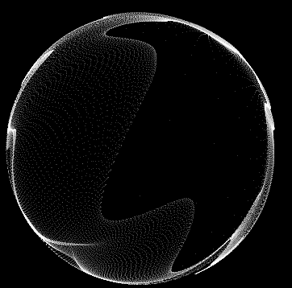

# 🎧 NCS Visualizer with Perlin Noise (SFML + C++)

A real-time audio visualizer inspired by **Spicetify NCSVisualizer** and NCS (NoCopyrightSounds) visuals. Built in C++ with [SFML](https://www.sfml-dev.org/) and smooth [Perlin noise](https://github.com/Reputeless/PerlinNoise), this project displays a pulsing sphere of glowing dots that react to the amplitude of your music.

<p align="center">
  
</p>

---

## ✨ Features

- 🎵 Real-time audio-reactive sphere
- 🌊 Perlin noise-based wave distortion
- 🧮 Dynamic sphere shaping and feathering
- ⚙️ Real-time control over:
  - Dot size
  - Noise frequency
  - Amplitude gain
- ⚡ Fast and lightweight using CPU-only rendering

---

## 🧠 Inspired By

- [**Spicetify NCSVisualizer**](https://github.com/khanhas/spicetify-ncs) (WebGL-based Spotify visualizer)
- Classic NCS visuals used in YouTube music videos
- Real-time graphics powered by SFML and mathematical noise

---

## 🚀 Getting Started

### 🔧 Prerequisites

- C++17 or later
- [SFML 2.6.x](https://www.sfml-dev.org/download.php)
- CMake (version 3.15+ recommended)
- [`PerlinNoise.hpp`](https://github.com/Reputeless/PerlinNoise) (header-only library)

### 🛠️ Build Instructions (CMake)

```bash
# Clone the repository
git clone https://github.com/your-username/ncs-visualizer.git
cd ncs-visualizer

# Create a build directory
mkdir build && cd build

# Generate build files
cmake ..

# Build the executable
cmake --build .


> ✅ Make sure `SFML` is installed and correctly linked. You can use system packages or build SFML yourself.

---

## 🎵 Usage

1. Place a `.wav` file named `faded.wav` in the root directory of the project.  
   - Only uncompressed `.wav` files are supported.  
   - You can convert `.mp3` to `.wav` using Audacity or online tools.  

2. Run the executable:
   ```bash
   ./NCSVisualizer
   ```

> ✅ Make sure `SFML` is installed and correctly linked. You can use system packages or build SFML yourself.

---

## 🎵 Usage

1. Place a `.wav` file named `faded.wav` in the root directory of the project.  
   - Only uncompressed `.wav` files are supported.  
   - You can convert `.mp3` to `.wav` using Audacity or online tools.  

2. Run the executable:
   ```bash
   ./NCSVisualizer
   ```

---

## 🎮 Runtime Controls

| Key         | Action                                      |
|-------------|---------------------------------------------|
| `↑ / ↓`     | Increase / decrease amplitude gain          |
| `← / →`     | Decrease / increase Perlin noise frequency  |
| `+ / -`     | Increase / decrease dot size                |
| `ESC` or X  | Close the window                            |

---
